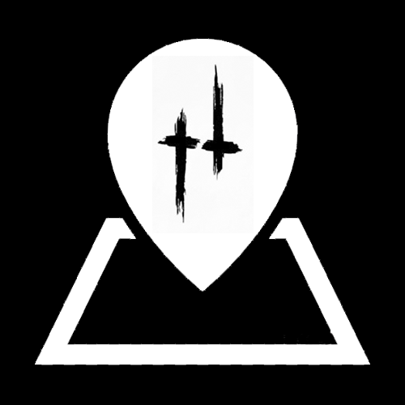

# Hunt map
Interactive maps for game Hunt-Showdown  
Stillwater Bayou & Lawson Delta

## Preview

## FAQ

`на карте отмечены НЕ все объекты` - карта создана сообществом игроков, мы рады новым вкладам

`можно добавить новые разделы?` - да, свяжитесь с автором  
`можно кружки маркеров заменить на иконки?` - да, если их нарисуют  
`почему расстояние меньше/больше (я точно знаю сколько там метров!)?` - из за разницы высот между точками, появляется погрешность  
`почему все на английском языке?` - если вы хотите сделать локализацию, свяжитесь с автором

`можно будет дополнительные поля для метки?` - да, будет сделано после обсуждения  
`можно будет дополнительно прикреплять скриншоты?` - в планах нет  
`можно будет отмечать на карте линии и полигоны?` - возможно будет добавлено позже

`я нашел ошибку` - свяжитесь с автором  
`я хочу быть модератором` - свяжитесь с автором  
`я frontend dev, хочу помочь` - свяжитесь с автором, проект OS с MIT лицензией, достаточно форкнуть и кинуть PR

### Примеры форматирование

ссылка  
`<a href="***" target="_blank" rel="noopener noreferrer">***</a>`

картинка  
``

ссылка + картинка  
`*** `

## Contributing
Please read [CONTRIBUTING.md](https://github.com/Findoss/Hunt-map/blob/master/CONTRIBUTING.md) for details on our code of conduct, and the process for submitting pull requests to us.

## Authors
 * Nikita Stroganov - Initial work

## License
[MIT](https://github.com/Findoss/Hunt-map/blob/master/LICENSE). Copyright (c) findoss.
