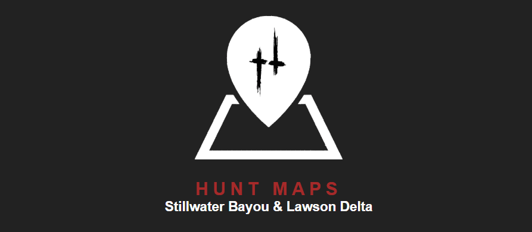

## Preview


## FAQ

#### - на карте отмечены НЕ все объекты

карта создана сообществом игроков, мы рады новым вкладам

#### - можно добавить новые разделы?

да, свяжитесь с автором

#### - можно кружки маркеров заменить на иконки?

да, если их нарисуют

#### - почему расстояние меньше/больше (я точно знаю сколько там метров!)?

из за разницы высот между точками, появляется погрешность

#### - я нашел ошибку

свяжитесь с автором

#### - я хочу быть модератором

свяжитесь с автором

#### - я frontend dev, хочу помочь

свяжитесь с автором, проект OS с MIT лицензией, достаточно форкнуть и кинуть PR

### Примеры добавления объектов

  
_Добавление маркера с загрузкой картинки_

  
_Добавление полигона_

  
_Добавление ломаной_

  
_Раздел модерации_

### Примеры форматирование для раздела description

Картинка  
```ТЕКСТ<br /><a href="ССЫЛКА_НА_КАРТИНКУ" target="_blank" rel="noopener noreferrer"></a>```

## Contributing

Please read [CONTRIBUTING.md](https://github.com/Findoss/Hunt-map/blob/master/CONTRIBUTING.md) for details on our code of conduct, and the process for submitting pull requests to us.

## Authors

- Findoss - Initial work
- Святобор - add markers
- Lapin - maps layer

## License

[MIT](https://github.com/Findoss/Hunt-map/blob/master/LICENSE). Copyright (c) Findoss.
